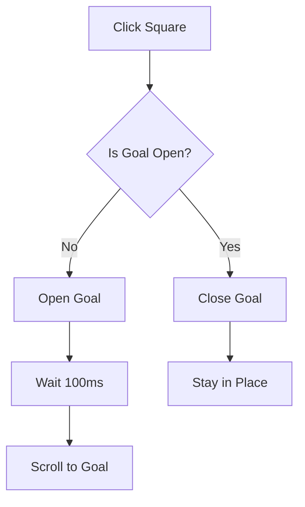

# Toggle Functionality and Increased Spacing

## Changes Made

### ✅ 1. Increased Spacing Between Squares

Changed from `gap-4` (16px) to `gap-6` (24px) for better visual separation and easier targeting.

```tsx
// Before
<div className="flex justify-center items-center gap-4 mb-3">

// After
<div className="flex justify-center items-center gap-6 mb-3">
```

### ✅ 2. Toggle Functionality (Click Again to Collapse)

Modified the click handler to toggle the goal card state instead of only opening it.

#### Before (Only Open, No Collapse)

```javascript
const handleSquareClick = () => {
  const goalElement = document.getElementById(`goal-card-${goalId}`);
  if (goalElement) {
    if (!isOpen) {
      toggleGoal(goalId);
      setTimeout(() => {
        goalElement.scrollIntoView({ behavior: "smooth", block: "center" });
      }, 100);
    } else {
      // Just scroll to it (no collapse)
      goalElement.scrollIntoView({ behavior: "smooth", block: "center" });
    }
  }
};
```

#### After (Toggle Open/Close)

```javascript
const handleSquareClick = () => {
  const goalElement = document.getElementById(`goal-card-${goalId}`);
  if (goalElement) {
    // Always toggle the goal (open if closed, close if open)
    toggleGoal(goalId);

    // Only scroll if opening (not when closing)
    if (!isOpen) {
      setTimeout(() => {
        goalElement.scrollIntoView({ behavior: "smooth", block: "center" });
      }, 100);
    }
  }
};
```

## Visual Changes

### Spacing Comparison

#### Before (gap-4 = 16px)

```
     [1]  [2]  [3]  [4]  [5]
```

#### After (gap-6 = 24px)

```
     [1]   [2]   [3]   [4]   [5]
```

(50% more space between squares)

## Click Behavior

### Complete User Flow

#### First Click (Goal Closed)

1. ✅ Toggles goal to **open** state
2. ✅ Scrolls to goal card smoothly
3. ✅ Card expands with animation
4. ✅ Square shows ring indicator

#### Second Click (Goal Open)

1. ✅ Toggles goal to **closed** state
2. ✅ Card collapses with animation
3. ❌ No scrolling (stays in place)
4. ✅ Ring indicator removed

#### Third Click (Goal Closed Again)

1. ✅ Toggles goal to **open** state
2. ✅ Scrolls to goal card again
3. ✅ Card expands
4. ✅ Ring indicator returns

### Visual Indicators

#### Goal Open

- **Square**: Shows orange ring (`ring-2 ring-primary ring-offset-2`)
- **Card**: Expanded with content visible
- **Chevron**: Points up (ChevronUp icon)

#### Goal Closed

- **Square**: No ring
- **Card**: Collapsed, only header visible
- **Chevron**: Points down (ChevronDown icon)

## Benefits

### 1. Increased Spacing (gap-6)

- ✅ **Easier to Click**: More space reduces mis-clicks
- ✅ **Better Visual Separation**: Squares feel less cramped
- ✅ **Touch-Friendly**: Better for mobile/tablet users
- ✅ **Cleaner Look**: More breathing room

### 2. Toggle Functionality

- ✅ **Intuitive**: Click to open, click again to close
- ✅ **Consistent**: Matches behavior of card header clicks
- ✅ **Efficient**: Quick collapse without scrolling
- ✅ **User Control**: Easy to hide completed goals

## Technical Details

### Gap Value Comparison

| Value | Pixels | Use Case                  |
| ----- | ------ | ------------------------- |
| gap-2 | 8px    | Very tight spacing        |
| gap-3 | 12px   | Compact spacing           |
| gap-4 | 16px   | Normal spacing (old)      |
| gap-5 | 20px   | Comfortable spacing       |
| gap-6 | 24px   | Generous spacing (new) ✅ |
| gap-8 | 32px   | Wide spacing              |

### Toggle Logic Flow



### Code Comparison

#### Key Changes

```diff
- <div className="flex justify-center items-center gap-4 mb-3">
+ <div className="flex justify-center items-center gap-6 mb-3">

  const handleSquareClick = () => {
    const goalElement = document.getElementById(`goal-card-${goalId}`);
    if (goalElement) {
-     if (!isOpen) {
-       toggleGoal(goalId);
-       setTimeout(() => {
-         goalElement.scrollIntoView({ behavior: 'smooth', block: 'center' });
-       }, 100);
-     } else {
-       goalElement.scrollIntoView({ behavior: 'smooth', block: 'center' });
-     }
+     toggleGoal(goalId);
+     if (!isOpen) {
+       setTimeout(() => {
+         goalElement.scrollIntoView({ behavior: 'smooth', block: 'center' });
+       }, 100);
+     }
    }
  };
```

## User Experience Scenarios

### Scenario 1: Working Through Goals Sequentially

1. Click Goal 1 square → Opens & scrolls
2. Fill out rating & comment
3. Click Goal 1 square again → Collapses
4. Click Goal 2 square → Opens & scrolls
5. Continue...

### Scenario 2: Reviewing Completed Goals

1. All goals completed and collapsed
2. Click Goal 3 square → Opens to review
3. Make edits
4. Click Goal 3 square → Collapses to save space

### Scenario 3: Jumping Between Goals

1. Goal 2 is open
2. Click Goal 5 square → Goal 2 stays open, Goal 5 opens & scrolls
3. Click Goal 5 square → Goal 5 collapses
4. Click Goal 2 square → Goal 2 collapses
5. Click Goal 1 square → Goal 1 opens & scrolls

### Scenario 4: Space Management

1. Multiple goals open taking up space
2. Click squares to collapse completed goals
3. Cleaner, more focused view
4. Re-open any goal easily

## Responsive Behavior

### Desktop

- Gap of 24px works perfectly
- Squares have plenty of space
- Easy mouse targeting

### Tablet

- Gap of 24px still comfortable
- Touch targets well-separated
- No accidental taps

### Mobile

- Gap of 24px prevents mis-taps
- Larger touch targets appreciated
- May wrap to 2 rows with many goals (acceptable)

## Edge Cases Handled

### Multiple Goals Open

- Clicking any square collapses its goal
- No conflict with other open goals
- Each square independently controls its goal

### Rapid Clicking

- Toggle state updates immediately
- Scroll only on open (not close)
- Smooth transitions

### Scroll Position

- Only scrolls when opening
- Stays in place when closing
- No jarring scroll on collapse

## Accessibility

### Keyboard Users

- Tab to square
- Enter/Space to toggle
- Clear focus indicators
- Expected toggle behavior

### Screen Readers

- Status announced on toggle
- "Expanded" or "Collapsed" state
- Goal title in aria-label

### Visual Feedback

- Ring indicator on open
- Color changes on completion
- Hover effects
- Smooth animations

## Testing Checklist

- [x] Increased spacing from gap-4 to gap-6
- [x] Toggle functionality implemented
- [ ] Test first click opens goal
- [ ] Test second click closes goal
- [ ] Verify scroll only happens on open
- [ ] Verify no scroll on close
- [ ] Test with multiple goals
- [ ] Test rapid toggling
- [ ] Verify ring indicator matches state
- [ ] Test keyboard navigation
- [ ] Test on mobile, tablet, desktop
- [ ] Verify spacing looks good with 2-10+ goals

## Files Modified

1. `frontend/src/pages/self-assessment/SelfAssessment.tsx`
   - Changed `gap-4` to `gap-6` (line ~330)
   - Simplified click handler to always toggle (line ~348)
   - Removed else branch that only scrolled
   - Scroll only happens when opening (!isOpen)

## Summary

### Changes

1. ✅ **Spacing**: Increased from 16px to 24px (50% more)
2. ✅ **Toggle**: Click to open, click again to close
3. ✅ **Smart Scroll**: Only scrolls when opening, not closing

### Benefits

- Better visual separation
- Easier to click/tap
- More intuitive interaction
- Consistent with card header behavior
- Better space management

### User Impact

- More comfortable clicking
- Cleaner interface
- Better control over open/closed state
- Reduces clutter when many goals open
